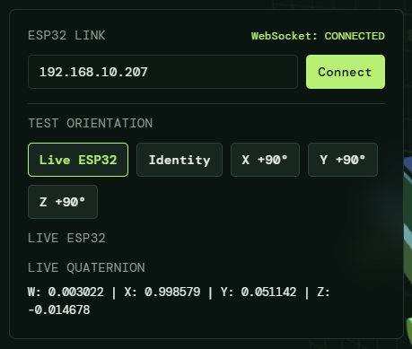
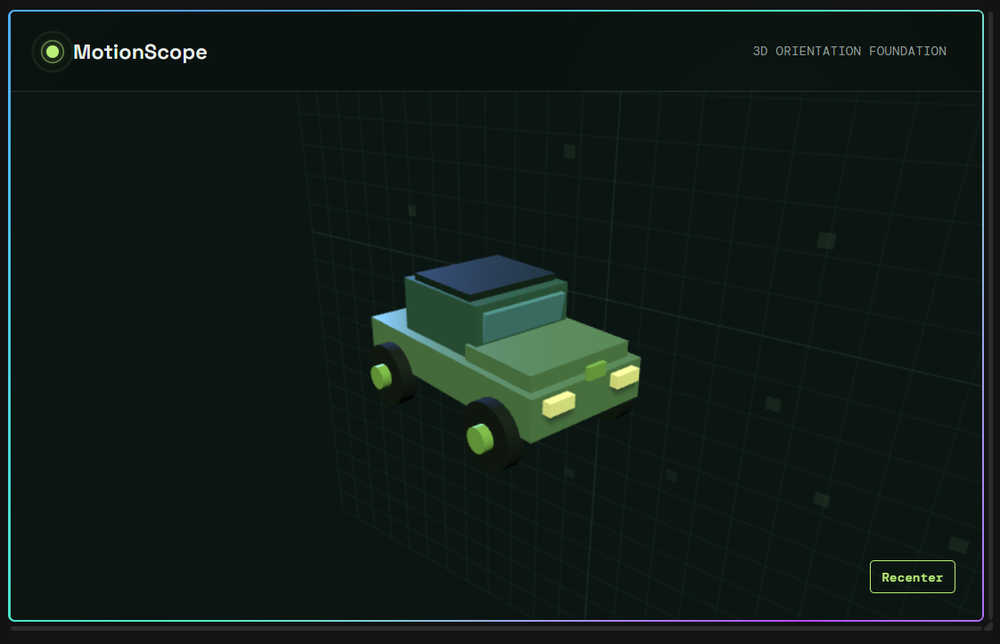

# MotionScope

> A real-time MPU6050 motion-tracking system built around an ESP32-S3,
> with a Three.js browser visualization.

MotionScope started as a sensor experiment and gradually became a
complete motion-visualization system. The goal is to take the movement
of a physical MPU6050/GY-521 and reproduce that movement on a 3D model
in the browser.

---

## Overview

The development progressed from hardware and sensor validation, through
calibration and orientation estimation, and finally into real-time
browser visualization.

The current system is able to:

- communicate reliably with the MPU6050
- read calibrated accelerometer and gyroscope data
- estimate orientation using quaternions
- use the accelerometer as a gravity reference
- transmit orientation data from the ESP32 to a PC
- receive the data through WebSocket
- convert the sensor orientation into a Three.js orientation
- rotate a 3D model in real time
- recenter the model orientation
- smooth the browser rendering
- correctly map the physical X/Y/Z rotations and their directions

The main remaining technical problem is **gyro drift**, which will be
addressed in a later development stage.

---

## Project Goal

The original idea was straightforward:

```text
Move the MPU6050
       ↓
Measure the movement
       ↓
Calculate orientation
       ↓
Send orientation to PC
       ↓
Rotate a 3D model
```

The final architecture became:

```text
┌──────────────┐
│   MPU6050    │
│    GY-521    │
└──────┬───────┘
       │ I2C
       ▼
┌──────────────┐
│    ESP32-S3  │
│              │
│ Sensor read  │
│ Orientation  │
│ estimation   │
└──────┬───────┘
       │ WebSocket
       ▼
┌──────────────┐
│   Browser    │
│              │
│   Three.js   │
└──────┬───────┘
       │
       ▼
┌──────────────┐
│  3D Vehicle  │
└──────────────┘
```

---

## Hardware

### Main components

- ESP32-S3
- MPU6050 / GY-521
- PC running the browser visualization

### Current I2C configuration

Signal ESP32-S3

---

SDA GPIO 8
SCL GPIO 9
MPU6050 address `0x68`

The MPU6050 is connected to the ESP32 through I2C.

---

## Wi-Fi Secrets Setup

Before building or uploading the firmware, create this file:

```text
include/secrets.h
```

Add the local Wi-Fi credentials using this template:

```cpp
#pragma once

#define WIFI_SSID "your-wifi-network"
#define WIFI_PASSWORD "your-wifi-password"
```

**Reminder:** `include/secrets.h` must be created and filled with valid
credentials before building the firmware. Do not commit real Wi-Fi
credentials to the repository.

---

## Development Journey

### 1. Hardware bring-up and sensor communication

The project began by getting the MPU6050 working reliably with the
ESP32-S3.

The early work involved:

- establishing I2C communication
- detecting the MPU6050
- confirming the sensor address
- investigating unexpected register/identity readings
- verifying that the physical module was actually an MPU6050
- getting stable accelerometer and gyroscope measurements

The GY-521 was eventually confirmed to communicate correctly at `0x68`.

This gave us a reliable foundation for everything that followed.

---

### 2. Sensor-library investigation and low-level debugging

The MPU6050 library behavior was investigated rather than treating the
library as a black box.

Register values, device identification, I2C behavior, and sensor
configuration were inspected during debugging.

The sensor configuration was eventually established as:

```cpp
mpu.setAccelerometerRange(MPU6050_RANGE_8_G);
mpu.setGyroRange(MPU6050_RANGE_500_DEG);
mpu.setFilterBandwidth(MPU6050_BAND_21_HZ);
```

This stage was important because orientation estimation is only useful
when the underlying sensor data is trustworthy.

---

### 3. Calibration and sensor characterization

The next part of the development focused on understanding how the
MPU6050 behaved in practice.

The sensor was tested in stationary and moving conditions while
observing:

- accelerometer output
- gyroscope output
- offsets and bias
- gravity magnitude
- noise
- filtering behavior
- response to physical rotation
- long-term stability

Several rounds of calibration and tuning were performed before moving
on.

The objective was not to make the sensor mathematically perfect, but to
establish a practical data source that could support orientation
estimation.

---

### 4. Sensor tuning and validation

The sensor configuration was refined through repeated physical tests.

The important outcome was a usable accelerometer/gyroscope data stream
with known characteristics.

The serial output eventually provided the six basic sensor channels:

```text
ax, ay, az
gx, gy, gz
```

These measurements became the raw input for the orientation-estimation
system.

The calibration and tuning work was intentionally completed before
introducing the browser visualization.

---

### 5. Building the orientation foundation

Once the sensor pipeline was sufficiently reliable, the project moved
from raw measurements to orientation.

A quaternion representation was introduced:

```cpp
struct Quaternion {
    float w;
    float x;
    float y;
    float z;
};
```

Quaternion multiplication and normalization were implemented.

Gyroscope angular velocity was integrated over measured time intervals
using `micros()`.

This produced a continuously changing orientation estimate.

The accelerometer was then incorporated as a gravity reference.

The correction system:

1.  measures acceleration magnitude
2.  determines whether the measurement is suitable for gravity
    correction
3.  normalizes the measured gravity vector
4.  calculates the expected gravity direction
5.  calculates the orientation error
6.  applies a small quaternion correction
7.  normalizes the orientation again

The current correction parameters include:

```cpp
#define ACCEL_CORRECTION_GAIN 0.05f
#define GRAVITY_ACCELERATION 9.80665f
#define ACCELERATION_TOLERANCE 2.0f
```

Additional serial diagnostics were added for:

- acceleration magnitude
- correction accepted/rejected state
- measured gravity vector
- expected gravity vector
- quaternion
- Euler roll/pitch/yaw

---

### 6. Three-axis orientation validation

The orientation estimator was tested against controlled physical
rotations.

The expected relationship was:

```text
Physical X rotation → Roll
Physical Y rotation → Pitch
Physical Z rotation → Yaw
```

The tests confirmed that the orientation estimator could be used as the
input to a 3D visualization.

Some measurements were interrupted during testing, but the overall
behavior was sufficient to proceed.

At this point, the project had successfully moved from raw sensor
readings to an actual orientation estimate.

---

### 7. Browser-based 3D visualization

The next major step was bringing the orientation into the browser.

Three.js was selected for rendering the 3D scene.

The browser application was built with:

- HTML
- CSS
- JavaScript
- Three.js

The initial scene included:

- perspective camera
- WebGL renderer
- lighting
- 3D object
- animation loop
- responsive resizing

A simple Python HTTP server is used to serve the browser application
from the PC.

The ESP32 does not need to host the browser files.

---

### 8. ESP32-to-browser communication

The browser and ESP32 were connected using WebSocket.

The browser connects to:

```text
ws://<ESP32-IP>:81/
```

The ESP32 sends quaternion orientation data.

The browser receives the quaternion and converts it into a Three.js
quaternion.

The resulting data path is:

```text
MPU6050
   ↓
ESP32
   ↓
Quaternion
   ↓
WebSocket
   ↓
Browser JavaScript
   ↓
Three.js Quaternion
   ↓
3D model
```

This created the first real end-to-end MotionScope system.

---

### 9. Coordinate-system correction

The first working browser implementation did not immediately match the
physical sensor axes.

Rotating the physical board around one axis could cause the model to
rotate around another axis.

The sensor-to-Three.js coordinate mapping was therefore tested and
corrected.

The final mapping was adjusted until:

- X movement affected the intended model axis
- Y movement affected the intended model axis
- Z movement affected the intended model axis
- rotation directions matched the intended physical movement

This was one of the most important debugging stages of the project.

The current mapping is considered **working**.

### Important development rule

The coordinate mapping is now a known-good part of the system.

Do not change axis-mapping code while working on unrelated problems such
as gyro drift.

In particular, changes involving the sensor-to-Three.js frame
transformation should always be tested against all three physical axes.

---

### 10. Recenter and browser-side smoothing

The browser was then improved so the visualization would be easier to
use.

A reference orientation can be stored and the live orientation can be
displayed relative to that reference.

This provides a recenter function.

Browser-side quaternion smoothing was also introduced to make the
rendered motion visually smoother.

The browser now contains:

- live orientation mode
- test orientations
- quaternion readout
- recentering
- connection status
- connection controls
- smoothed rendering

---

### 11. MotionScope interface and 3D presentation

The browser interface was then developed into the current MotionScope
presentation.

The UI was intentionally designed separately from the
orientation-processing logic.

The current interface includes:

- MotionScope branding
- ESP32 connection panel
- WebSocket status
- test orientation controls
- live quaternion information
- recenter control
- collapsible connection controls

The 3D model evolved from a simple tank/device-style object into a more
visually appealing vehicle/car-style model.

The current presentation goal is to have the vehicle floating in the
scene without a floor/grid underneath it.

---

## Current Architecture

```text
MotionScope/
│
├── src/
│   └── main.cpp
│
├── browser/
│   ├── index.html
│   ├── style.css
│   └── main.js
│
├── docs/
├── include/
├── lib/
├── test/
├── platformio.ini
├── README.md
└── LICENSE
```

The firmware remains centered around `src/main.cpp`.

The browser application is kept separately under `browser/`.

The PC serves the browser files through a local HTTP server.

The ESP32 handles sensor acquisition, orientation estimation, and
WebSocket communication.

---

## Current Working State

MotionScope can now:

- detect the MPU6050
- read accelerometer and gyroscope data
- estimate orientation
- correct orientation using gravity
- output quaternion orientation
- transmit orientation over Wi-Fi/WebSocket
- receive orientation in the browser
- convert the sensor orientation to the Three.js coordinate system
- rotate a 3D model in real time
- recenter the orientation
- smooth the rendered motion
- correctly reproduce the physical X/Y/Z movement and direction

The core objective has therefore been achieved:

> **Move the physical MPU6050 and the 3D model moves with it.**

---

## Known Limitation

### Gyro drift

The model slowly changes orientation even when the MPU6050 is
stationary.

This is currently visible and expected from the present
orientation-estimation approach.

It is **not considered a blocker** for the current visualization
milestone.

Gyro drift will be addressed as a separate future engineering task.

Potential future work includes:

- stationary detection
- gyro bias estimation
- improved zero-rate calibration
- bias compensation
- better filtering
- improved accelerometer/gyro fusion
- complementary filtering
- Madgwick-style sensor fusion if appropriate

The most important constraint is:

> **Improve drift without breaking the already-correct three-axis
> mapping.**

---

## Next Development Direction

The next major technical objective is to improve long-term orientation
stability.

The existing working system should be preserved as the baseline.

Future changes should be incremental:

```text
Current working orientation
          ↓
Measure drift
          ↓
Identify gyro bias
          ↓
Apply compensation
          ↓
Retest stationary behavior
          ↓
Retest X/Y/Z movement
          ↓
Improve fusion if necessary
```

---

## Development Principle

MotionScope was built incrementally.

Each major addition was tested before the next layer was introduced:

```text
Hardware
   ↓
Sensor communication
   ↓
Calibration
   ↓
Sensor tuning
   ↓
Orientation estimation
   ↓
Orientation validation
   ↓
3D rendering
   ↓
WebSocket communication
   ↓
Coordinate correction
   ↓
Real-time visualization
   ↓
Presentation
```

This layered approach makes it possible to isolate problems instead of
debugging the entire system at once.

---

## Image Gallery

The following placeholders can be replaced with actual project
screenshots/photos later.

### Hardware

**Hardware**

![Hardware] (docs/images/hardware.jpeg)

### Live connection

**Live Conncetion Interface**



### Final visualization

**Final MotionScope Interface**



---

## Milestone

MotionScope has evolved from a basic MPU6050 experiment into a working
real-time motion visualization system.

The sensor, firmware, communication, orientation mathematics, browser
rendering, coordinate mapping, and interface are now connected into one
system.

The next challenge is no longer **"Can we make it work?"**

It is:

> **"How stable and polished can we make it?"**
